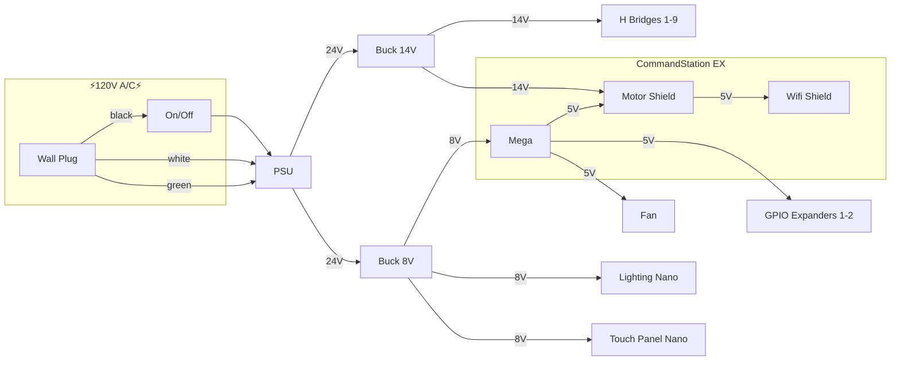
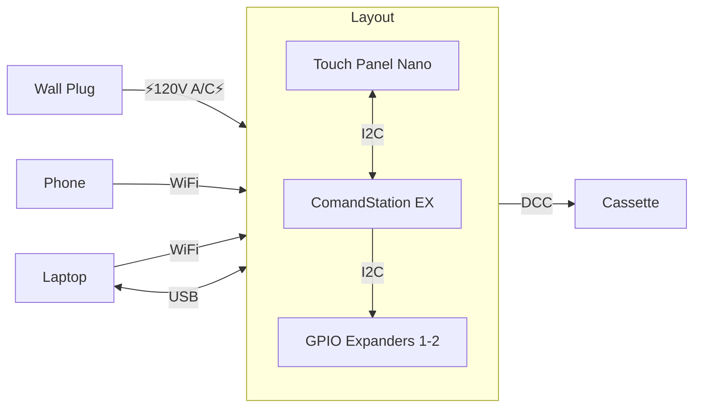
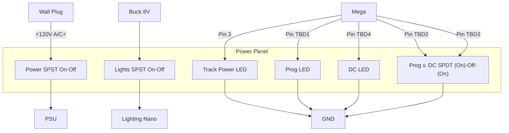

# DCC-EX config and automation settings for CB&Q Lumber District.

## Prerequisites

1. 1Password CLI

## Setup

`make` will do the following:
1. git clone the CommandStation-EX repo
1. switch it to the specified branch
1. copy the local header comfig/marco files into the CommandStation-EX folder

## TODOs

1. Can we use arduino-cli to make the project?
1. Will eventually have code for the I2C arduinos that manage the touch toggles

## Diagrams

### Power Distribution

### Communication & Ports

### Power Panel Wiring

