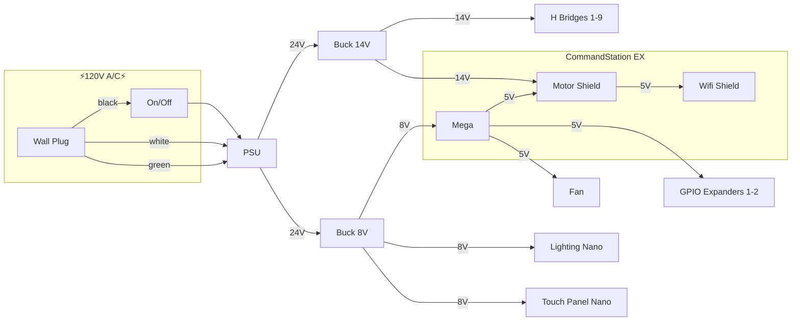
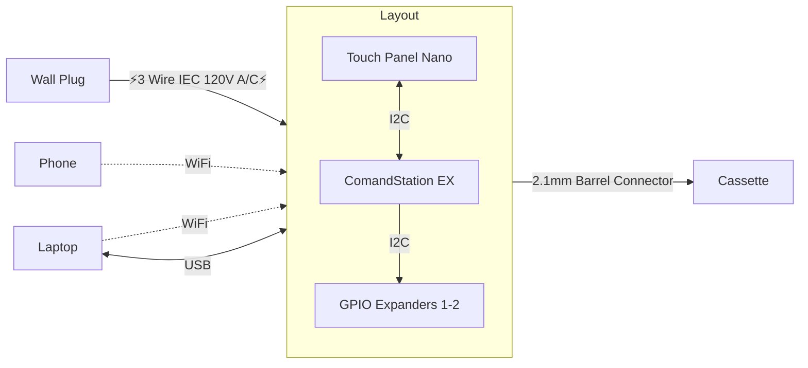
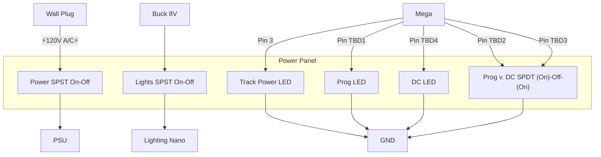

# lumber_district

Configuration and automation settings for an N scale layout modeled off of CB&Q's Lumber District in Chicago's Pilsen neighborhood during the 1950s/60s.

Trains on the main section of the layout are powered by DCC signals generated by CommandStation-EX running on an Arduino Mega with an Arduino Motor Shield and a Makerfabs ESP8266 WiFi shield. 

A secondary track can toggle between DCC Programming mode and DC power to run legacy DC locomotives. This will most often run a street trolley with automation scripted by EX-RAIL. 

Mimic panels are designed around Berret Hill Touch Toggles driven by custom code loaded onto an Arduino Nano Every which communicates with the Mega over I2C

Also on the I2C bus are two 16pin GPIO expanders to activate L289N H Bridges to drive the Kato Unitrack snap turnouts.

Finally an Arduino Nano Every with custom code drives static and animated LED lighting across the layout. 

## Prerequisites

1. Unix-like system with GNU make (developed and tested on MacOS)
1. [1Password CLI](https://developer.1password.com/docs/cli/get-started#install) - so that I don't have to commit my home wifi network password
1. [Arduino IDE](https://www.arduino.cc/en/software) - v1.8.x is preferred over 2.0.x as it generates more compact compiled objects.

TODO investigate use of [arduino-cli](https://github.com/arduino/arduino-cli) instead of IDE

## Setup

`make` will do the following:
1. git clone the CommandStation-EX repo
1. switch it to the specified branch
1. copy the local header comfig/marco files into the CommandStation-EX folder

## TODOs

1. Will eventually have code for the I2C arduinos that manage the touch toggles

## Diagrams

### Power Distribution

### Communication & Ports

### Power Panel Wiring

