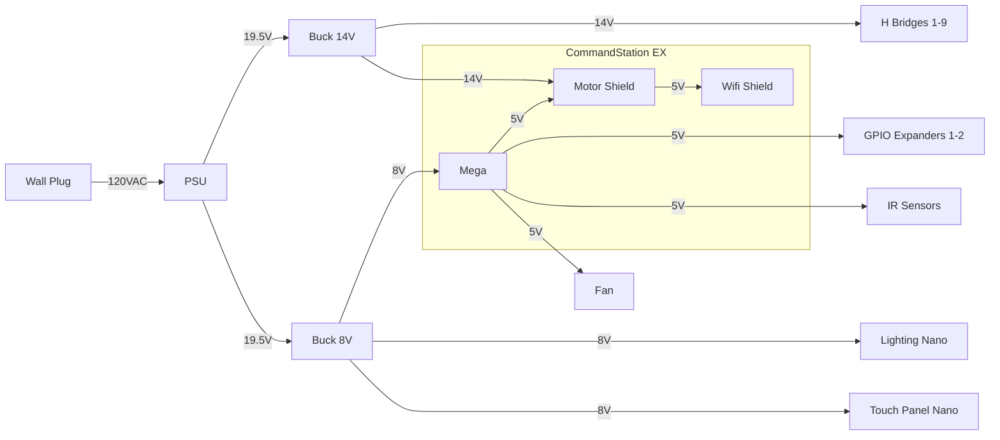
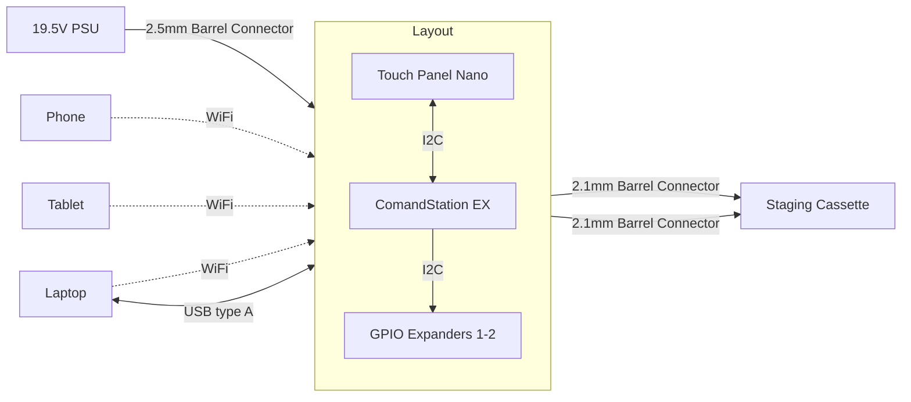
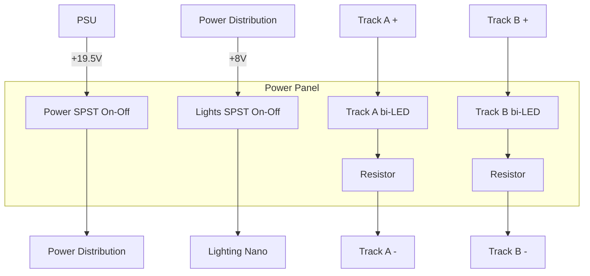
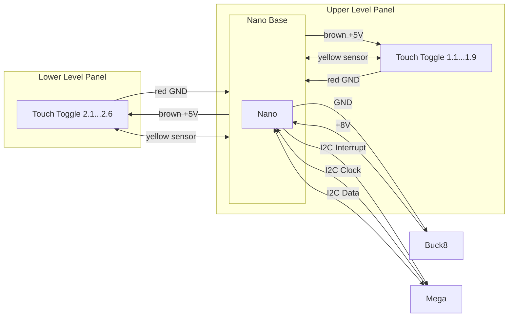

# Power Distribution

```mermaid
flowchart LR
  P120[Wall Plug]
  PSU
  P120 -->|120VAC| PSU
  Buck14[Buck 14V]
  Buck8[Buck 8V]
  PSU -->|19.5V| Buck14 & Buck8
  subgraph CmdStn[CommandStation EX]
    direction BT
    Mega
    Motor[Motor Shield]
    WiFi[Wifi Shield]
    Mega -->|5V| Motor -->|5V| WiFi
    end
  Lights[Lighting Nano]
  Touch[Touch Panel Nano]
  Gpio["GPIO Expanders 1-2"]
  HBridge["H Bridges 1-9"]
  IRSensors[IR Sensors]
  Buck8 -->|8V| Mega
  Buck8 ----->|8V| Lights & Touch
  Buck14 ----->|14V| HBridge
  Buck14 --->|14V| Motor
  Mega ---->|5V| Gpio & IRSensors
  Mega -->|5V| Fan
```

# Communication & Ports

```mermaid
flowchart LR
  subgraph Layout
    CmdStn[ComandStation EX]
    Touch[Touch Panel Nano]
    Gpio["GPIO Expanders 1-2"]
    Touch <-->|I2C| CmdStn
    CmdStn -->|I2C| Gpio
    end
  PSU[19.5V PSU]
  PSU -->|"2.5mm Barrel Connector"| Layout
  Phone & Tablet & Laptop -.->|WiFi| Layout
  Laptop <-->|USB type A| Layout
  Layout -->|2.1mm Barrel Connector| Cassette[Staging Cassette]
  Layout -->|2.1mm Barrel Connector| Cassette[Staging Cassette]
```

# Power Panel Wiring

```mermaid
flowchart 
  subgraph Panel[Power Panel]
    Toggle1[Power SPST On-Off]
    Toggle2[Lights SPST On-Off]
    LED1A["Track A bi-LED"]
    ResistorA[Resistor]
    LED1B["Track B bi-LED"]
    ResistorB[Resistor]
    end
  PSU -->|"+19.5V"| Toggle1 ---> pd[Power Distribution]
  pd8[Power Distribution] -->|"+8V"| Toggle2 ---> Lights[Lighting Nano]
  TrackA["Track A +"] --> LED1A --> ResistorA --> TrackAneg["Track A -"]
  TrackB["Track B +"] --> LED1B --> ResistorB --> TrackBneg["Track B -"]
```

# Touch Panels Wiring

```mermaid
flowchart LR
  subgraph tp1[Lower Level Panel]
    touchLP["Touch Toggle 2.1...2.6"]
    end
  subgraph tp2[Upper Level Panel]
    subgraph base[Nano Base]
      Nano
      end
    touchUP["Touch Toggle 1.1...1.9"]
    end
  Buck8 -->|+8V| Nano -->|GND| Buck8
  Mega -->|I2C Clock| Nano
  Mega <-->|I2C Data| Nano
  Nano -->|I2C Interrupt| Mega
  base -->|"brown +5V"| touchLP & touchUP -->|"red GND"| base
  base <-->|"yellow sensor"| touchLP & touchUP

```
