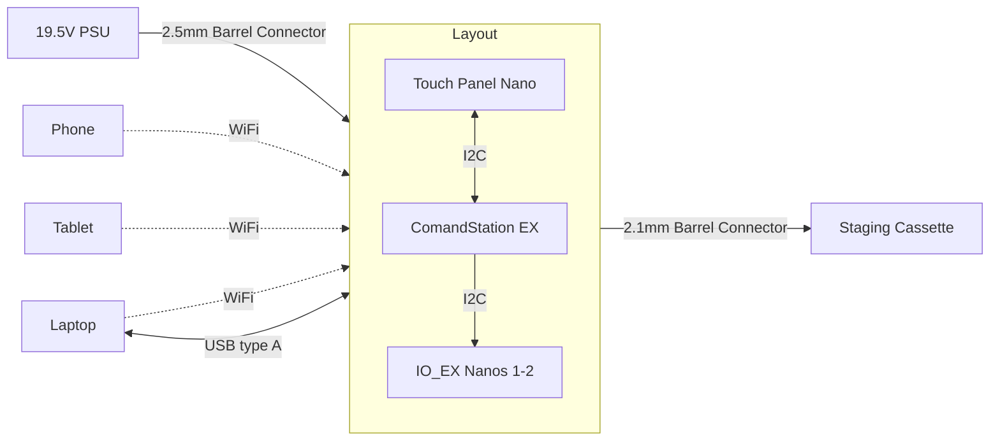

# Power Distribution


# Communication & Ports




# Control Panel Wiring

```mermaid
flowchart LR
  subgraph lp[Right Pane]
    touchLP["Touch Toggle 2.1...2.6"]
  end
  subgraph cp[Center Pane]
    Powerp["19.5vdc +"] ---> toggle[Power Toggle] ---> Powern["19.5vdc -"]
    TrackAp["Track A +"] ---> LEDa["Bi-color LED"] --> ResistorA["Resistor"] --> TrackAn["Track A -"]
    TrackBp["Track B +"] ---> LEDb["Bi-color LED"] --> ResistorB["Resistor"] --> TrackBn["Track B -"]
    9Vp["9.0 VDC +"] ---> Nano ---> 9Vn["9.0 VDC -"]
    I2Cc["I2C Clock"] <---> Nano <---> I2Cd["I2C Data"]
  end
  subgraph rp[Left Pane]
    touchRP["Touch Toggle 1.1...1.9"]
  end
  Nano ---->|"brown +5V"| touchLP & touchRP --->|"red GND"| Nano
  Nano <---->|"yellow sensor"| touchLP & touchRP
